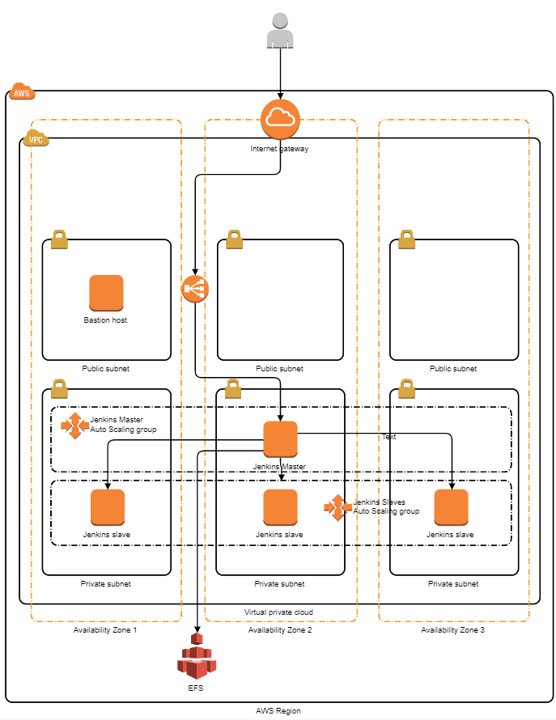

# Jenkins AWS

This repository contains sample templates to provision a Jenkins master node infrastructure in AWS (source code to provision Jenkins slaves could be found in [https://github.com/francescomedas/jenkins-slave](https://github.com/francescomedas/jenkins-slave)).

## Reference architecture

## Jenkins pipelines as code examples
You will find basic examples of how to write simple pipelines as code in [https://github.com/francescomedas/jenkins-pipeline-examples](https://github.com/francescomedas/jenkins-pipeline-examples))
